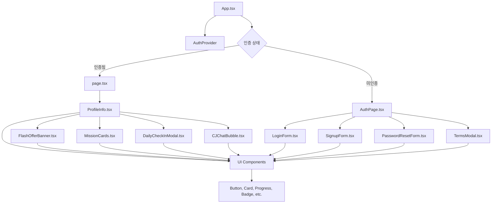

# 🎮 게임 플랫폼 기술 개요

## 프로젝트 개요
기본적인 게임 플랫폼 프로필 페이지입니다.

## 기술 스택
- Next.js
- TypeScript
- Tailwind CSS

## 현재 구현 상태
- 기본 프로젝트 구조 설정 완료
- 프로필 페이지 초기 상태

---
**상태:** 초기화 완료

### UI/UX 디자인 시스템
- **다크 테마**: 게임 환경에 최적화된 다크 모드
- **네온 퍼플 & 레드**: 브랜드 아이덴티티를 나타내는 핵심 색상
- **글래스모피즘**: 깊이감과 세련미를 더하는 UI 스타일
- **모바일 우선**: 400x750px 해상도에 최적화된 반응형 디자인
- **팝업 모드**: 데스크톱 환경에서 모바일 앱처럼 보이도록 하는 레이아웃

## 📁 프로젝트 구조

```
├── app/
│   ├── layout.tsx             # 루트 레이아웃
│   └── page.tsx               # 메인 페이지 (프로필 대시보드)
├── components/
│   ├── auth/                  # 인증 관련 컴포넌트
│   │   ├── AuthContext.tsx
│   │   ├── AuthPage.tsx
│   │   └── ...
│   ├── profile/               # 프로필 관련 컴포넌트
│   │   ├── ProfileInfo.tsx
│   │   ├── FlashOfferBanner.tsx
│   │   ├── DailyCheckInModal.tsx
│   │   ├── CJChatBubble.tsx
│   │   ├── MissionCards.tsx
│   │   └── types.ts
│   └── ui/                    # 재사용 가능한 UI 컴포넌트 (39개)
├── styles/
│   └── globals.css            # 전역 스타일 및 CSS 변수
└── ... (기타 파일)
```

## 🎨 디자인 시스템

### 색상 팔레트
- **네온 퍼플**: `#5B30F6` (Primary)
- **악센트 레드**: `#FF4516` (Accent)
- **다크 네이비**: `#1A1A1A` (Background)
- **차콜**: `#2D2D2D` (Card)

### 타이포그래피
- **Exo**: 제목 및 주요 텍스트
- **Epilogue**: 본문 및 보조 텍스트

### CSS 관리
- **`styles/globals.css`**: 모든 디자인 토큰(색상, 폰트, 간격 등)을 CSS 변수로 정의하여 일관성 있는 스타일 적용

## 🚀 주요 컴포넌트

### AuthContext
- **역할**: 전역 인증 상태 관리
- **기능**:
  - 사용자 정보, 토큰, 인증 상태 저장
  - 로그인, 로그아웃, 회원가입, 비밀번호 재설정 함수 제공
  - `localStorage`를 사용한 영속 로그인

### ProfileInfo
- **역할**: 사용자 프로필 정보와 도파민 루프 요소들을 통합 관리
- **주요 기능**:
  - 사용자 기본 정보 (닉네임, 랭크, 토큰)
  - 연속 접속 스트릭 표시
  - 레벨 및 경험치 진행률
  - 게임 시작 및 설정 버튼

### FlashOfferBanner
- **역할**: 시간 제한 특가 이벤트 배너
- **주요 기능**:
  - 실시간 카운트다운 타이머
  - 할인율 및 가격 표시
  - 긴급성 강조 애니메이션
  - 본사 사이트 연계 CTA

### CJChatBubble
- **역할**: AI 챗봇 인터페이스
- **주요 기능**:
  - 상황별 맞춤 메시지 제공
  - 감정 상태 표시 (excited, encouraging, congratulatory, urgent, friendly)
  - 행동 유도 버튼 (Action Suggestion)
  - 부유하는 애니메이션 효과

### DailyCheckInModal
- **역할**: 일일 체크인 시스템
- **주요 기능**:
  - 연속 접속 스트릭 추적
  - 주간 보상 캘린더 표시
  - 시간 제한 및 FOMO 유발 요소
  - 체크인 보상 애니메이션

### MissionCards
- **역할**: 미션 시스템
- **주요 기능**:
  - 일일/주간/특별 미션 분류
  - 진행률 표시 및 완료 상태
  - 보상 토큰 표시
  - 본사 사이트 연계 추가 미션

## 🎮 도파민 루프 구현 전략

- **희소성 & 긴급성**: Flash Offer, Daily Check-in, 특별 미션을 통해 긴급 행동 유도
- **변동 보상**: 가챠 시스템, 랜덤 보상 박스, 연속 접속 보너스
- **단계적 목표**: 레벨, 경험치, 연속 접속 스트릭, 랭크 시스템
- **사회적 증명**: 랭크, 리더보드, 특별 배지 시스템

## 🔗 본사 사이트 연계

- **순환 사용자 플로우**: 앱 내 토큰 소모 → 부족 시 본사 사이트 유도 → 충전 후 앱 복귀
- **CTA 배치**: 모든 주요 화면에 본사 사이트 링크, 토큰 부족 시 긴급 알림, Flash Offer 및 미션을 통한 자연스러운 유도

---

**마지막 업데이트:** 2024년 12월 16일  
**버전:** 1.0.0  
**작성자:** AI Assistant

### DailyCheckInModal
일일 체크인 시스템:
- 연속 접속 스트릭 추적
- 주간 보상 캘린더 표시
- 시간 제한 및 FOMO 유발 요소
- 체크인 보상 애니메이션

### MissionCards
미션 시스템:
- 일일/주간/특별 미션 분류
- 진행률 표시 및 완료 상태
- 보상 토큰 표시
- 본사 사이트 연계 추가 미션

## 🔧 개발 환경 설정

### 필수 요구사항
- Node.js 18+
- npm 또는 yarn
- 모던 브라우저 (Chrome, Firefox, Safari, Edge)

### 설치 및 실행
```bash
# 의존성 설치
npm install

# 개발 서버 실행
npm run dev

# 빌드
npm run build

# 프로덕션 실행
npm start
```

### 주요 의존성
```json
{
  "dependencies": {
    "next": "15+",
    "react": "18+",
    "typescript": "5+",
    "tailwindcss": "4.0",
    "framer-motion": "latest",
    "sonner": "2.0.3",
    "lucide-react": "latest"
  }
}
```

## 📱 반응형 디자인

### 모바일 우선 접근법
- 기준 해상도: 400x750px
- 터치 친화적 UI 요소 (최소 44px)
- 스와이프 제스처 지원

### 팝업 모드
```css
.popup-mode {
  max-width: 400px;
  max-height: 750px;
  margin: 0 auto;
  overflow-y: auto;
}
```

## 🎮 도파민 루프 구현

### Scarcity & Urgency (희소성 & 긴급성)
- Flash Offer 시간 제한
- Daily Check-in 놓치면 초기화
- 특별 미션 24시간 제한
- 토큰 부족 시 즉시 충전 유도

### Variable Reward (변동 보상)
- 가챠 시스템 (향후 구현 예정)
- 랜덤 보상 박스
- 연속 접속 보너스 증가

### Progressive Goals (단계적 목표)
- 레벨 시스템 (1-100)
- 경험치 진행률 표시
- 연속 접속 스트릭 (7일 사이클)
- 랭크 업그레이드 시스템

### Social Proof (사회적 증명)
- 랭크 시스템 (STANDARD → PREMIUM → VIP)
- 리더보드 (향후 구현 예정)
- 특별 배지 시스템

## 🔗 본사 사이트 연계

### 순환 사용자 플로우
1. 앱에서 토큰 소모
2. 토큰 부족 시 본사 사이트 유도
3. 본사에서 토큰 충전
4. 앱으로 돌아와서 계속 플레이

### CTA 배치 전략
- 모든 주요 화면에 본사 사이트 링크
- 토큰 부족 시 긴급 알림
- Flash Offer를 통한 자연스러운 유도
- 미션 시스템을 통한 정기적 방문 유도

## 🔐 보안 고려사항

### 클라이언트 보안
- XSS 방지를 위한 입력 검증
- CSRF 토큰 적용 (향후 구현)
- 민감한 데이터 localStorage 대신 secure cookie 사용 권장

### 인증 보안
- JWT 토큰 만료 시간 설정
- 리프레시 토큰 구현 (향후)
- 비밀번호 강도 검증

## 🚀 성능 최적화

### 코드 스플리팅
- 컴포넌트 기반 lazy loading
- 라우트 기반 코드 분할

### 이미지 최적화
- Next.js Image 컴포넌트 활용
- WebP 포맷 지원
- Responsive 이미지 제공

### CSS 최적화
- CSS 변수 활용한 테마 시스템
- 불필요한 CSS 제거
- Critical CSS 인라인화

## 📊 모니터링 및 분석

### 사용자 행동 추적
- 버튼 클릭 이벤트 로깅
- 페이지 체류 시간 측정
- 본사 사이트 이동 추적

### 성능 모니터링
- Core Web Vitals 측정
- 로딩 시간 모니터링
- 오류 추적 및 리포팅

## 🔄 향후 개발 계획

### 단기 목표 (1-2주)
- [ ] 실제 API 연동
- [ ] 가챠 시스템 구현
- [ ] 리더보드 시스템
- [ ] 푸시 알림 시스템

### 중기 목표 (1-2개월)
- [ ] 실시간 멀티플레이어 게임
- [ ] 소셜 기능 (친구, 길드)
- [ ] 결제 시스템 연동
- [ ] 고급 분석 대시보드

### 장기 목표 (3-6개월)
- [ ] AI 기반 개인화 추천
- [ ] 크로스 플랫폼 지원
- [ ] 다국어 지원
- [ ] 고급 보안 기능

## 📚 참고 자료

### 기술 문서
- [Next.js 공식 문서](https://nextjs.org/docs)
- [TypeScript 핸드북](https://www.typescriptlang.org/docs/)
- [Tailwind CSS 가이드](https://tailwindcss.com/docs)
- [Framer Motion 문서](https://www.framer.com/motion/)

### 디자인 가이드
- [CSS 디자인 시스템](./CSS_DESIGN_SYSTEM.md)
- [개발 가이드라인](./Guidelines.md)
- [UI/UX 디자인 문서](./UI_UX_DESIGN.md)

### 게임 UI/UX 참고
- [F2P 게임 UI 패턴](https://gameui.dev/)
- [모바일 게임 UX 가이드](https://uxdesign.cc/)
- [도파민 루프 설계](https://www.psychology.org/)

---

**마지막 업데이트:** 2024년 12월 16일  
**버전:** 1.0.0  
**작성자:** AI Assistant  
**라이선스:** MIT


# 🔍 시스템 분석 및 개선 계획 문서

## 📋 목차

1. [현재 시스템 구조 분석](#현재-시스템-구조-분석)
2. [컴포넌트 의존성 관계도](#컴포넌트-의존성-관계도)
3. [UI/UX 개선 우선순위](#uiux-개선-우선순위)
4. [단계별 구현 계획](#단계별-구현-계획)
5. [세부 구현 사항](#세부-구현-사항)
6. [검증 및 테스트 계획](#검증-및-테스트-계획)
7. [성능 최적화 계획](#성능-최적화-계획)

---

## 현재 시스템 구조 분석

### 📁 파일 구조 현황

```
📦 프로젝트 루트
├── 🎯 App.tsx                     # 메인 애플리케이션 엔트리포인트
├── 📄 page.tsx                    # 프로필 페이지 (메인 대시보드)
├── 📚 문서 파일들
│   ├── Guidelines.md              # 개발 가이드라인
│   ├── CSS_DESIGN_SYSTEM.md       # CSS 디자인 시스템 문서
│   ├── TECHNICAL_OVERVIEW.md      # 기술 개요 문서
│   └── Attributions.md            # 라이선스 및 크레딧
├── 🧩 components/
│   ├── 🔐 auth/                   # 인증 관련 컴포넌트
│   │   ├── AuthContext.tsx        # 인증 상태 관리
│   │   ├── AuthPage.tsx           # 인증 페이지 컨테이너
│   │   ├── LoginForm.tsx          # 로그인 폼
│   │   ├── SignupForm.tsx         # 회원가입 폼
│   │   ├── PasswordResetForm.tsx  # 비밀번호 재설정 폼
│   │   ├── TermsModal.tsx         # 약관 모달
│   │   └── types.ts               # 인증 타입 정의
│   ├── 👤 profile/                # 프로필 관련 컴포넌트
│   │   ├── ProfileInfo.tsx        # 메인 프로필 컴포넌트
│   │   ├── FlashOfferBanner.tsx   # 플래시 세일 배너
│   │   ├── DailyCheckInModal.tsx  # 일일 체크인 모달
│   │   ├── CJChatBubble.tsx       # CJ AI 챗봇
│   │   ├── MissionCards.tsx       # 미션 카드 시스템
│   │   └── types.ts               # 프로필 타입 정의
│   ├── 🖼️ figma/                  # Figma 연동 컴포넌트
│   │   └── ImageWithFallback.tsx  # 이미지 폴백 컴포넌트
│   └── 🎨 ui/                     # 재사용 가능한 UI 컴포넌트 (39개)
└── 🎨 styles/
    └── globals.css                # 전역 스타일 및 디자인 시스템
```

### 🎯 핵심 컴포넌트 분석

#### 1. **App.tsx** (메인 애플리케이션)
- **역할**: 최상위 애플리케이션 컨테이너
- **주요 기능**:
  - 인증 상태 관리 (AuthProvider)
  - 다크 테마 적용
  - 토스트 알림 시스템 (Sonner)
  - 조건부 렌더링 (인증 페이지 vs 프로필 페이지)

#### 2. **page.tsx** (프로필 페이지)
- **역할**: 메인 대시보드 페이지
- **주요 기능**:
  - 사용자 프로필 정보 로딩
  - 게임 대시보드 UI 표시
  - 도파민 루프 요소들 관리
  - 본사 사이트 연계 기능

#### 3. **ProfileInfo.tsx** (핵심 UI 컴포넌트)
- **역할**: 메인 프로필 정보 표시
- **현재 구현 상태**: A급 프리미엄 디자인 완료
- **주요 기능**:
  - 글래스모피즘 카드 디자인
  - 사용자 정보 (닉네임, 레벨, 경험치, 토큰)
  - 연속 접속 스트릭 표시
  - 게임 시작 및 설정 버튼

---

## 컴포넌트 의존성 관계도

### 📊 의존성 플로우 차트



### 🔗 핵심 의존성 분석

#### **인증 플로우**
1. `App.tsx` → `AuthContext` → `AuthPage.tsx`
2. `AuthPage.tsx` → `LoginForm/SignupForm/PasswordResetForm`
3. 인증 성공 시 → `page.tsx` 이동

#### **프로필 플로우**
1. `page.tsx` → `ProfileInfo.tsx` (메인 컨테이너)
2. `ProfileInfo.tsx` → 도파민 루프 컴포넌트들
3. 모든 컴포넌트 → `components/ui/` 기본 UI 컴포넌트

#### **상태 관리**
- **글로벌 상태**: `AuthContext` (인증 상태)
- **로컬 상태**: 각 컴포넌트의 `useState`
- **영속 상태**: `localStorage` (토큰, 사용자 정보)

---

## UI/UX 개선 우선순위

### 🎯 우선순위 매트릭스

| 우선순위 | 컴포넌트 | 현재 상태 | 목표 상태 | 영향도 | 난이도 |
|---------|----------|-----------|-----------|--------|-------|
| **HIGH** | ProfileInfo.tsx | A급 완료 | 미세 조정 | 🔥🔥🔥 | 🟢 |
| **HIGH** | MissionCards.tsx | A급 완료 | 미세 조정 | 🔥🔥🔥 | 🟢 |
| **HIGH** | FlashOfferBanner.tsx | A급 완료 | 미세 조정 | 🔥🔥🔥 | 🟢 |
| **MEDIUM** | DailyCheckInModal.tsx | A급 완료 | 미세 조정 | 🔥🔥 | 🟢 |
| **MEDIUM** | CJChatBubble.tsx | A급 완료 | 미세 조정 | 🔥🔥 | 🟢 |
| **LOW** | AuthPage.tsx | B급 | A급 개선 | 🔥 | 🟡 |
| **LOW** | 새로운 기능 | 미구현 | 신규 개발 | 🔥 | 🔴 |

### 🎨 디자인 품질 평가

#### **A급 완료 컴포넌트**
- ✅ **ProfileInfo.tsx**: 글래스모피즘, 3D 효과, 프리미엄 디자인
- ✅ **MissionCards.tsx**: 미션별 컬러 테마, 진행도 시각화
- ✅ **FlashOfferBanner.tsx**: 실시간 애니메이션, 긴급성 디자인
- ✅ **DailyCheckInModal.tsx**: 주간 캘린더, 보상 애니메이션
- ✅ **CJChatBubble.tsx**: 감정 상태별 테마, 부유하는 효과

#### **개선 필요 영역**
- 🟡 **전체 레이아웃**: 간격 및 배치 미세 조정
- 🟡 **애니메이션**: 성능 최적화 및 부드러움 개선
- 🟡 **반응형**: 다양한 화면 크기 대응
- 🟡 **접근성**: 키보드 네비게이션, 스크린 리더 지원

---

## 단계별 구현 계획

### 🚀 Phase 1: 기본 레이아웃 최적화 (1-2일)

#### **1.1 현재 상태 분석**
```typescript
// 체크리스트
□ 현재 ProfileInfo.tsx의 레이아웃 구조 확인
□ 간격 시스템 (spacing) 일관성 검토
□ 카드 정렬 및 배치 검토
□ 모바일 최적화 상태 확인
```

#### **1.2 레이아웃 개선 작업**
- **프로필 헤더 영역**:
  - 아바타 크기 및 위치 조정
  - 닉네임, 레벨, 스트릭 정보 배치 최적화
  - 랭크 배지 디자인 개선

- **통계 카드 영역**:
  - 토큰, 경험치 카드 간격 조정
  - 진행률 바 디자인 정제
  - 호버 효과 성능 최적화

- **액션 버튼 영역**:
  - 게임 시작 버튼 크기 및 위치 조정
  - 설정 버튼 접근성 개선
  - 버튼 그룹 간격 최적화

### 🎯 Phase 2: 미션 시스템 강화 (2-3일)

#### **2.1 미션 카드 레이아웃 개선**
```typescript
// 개선 목표
- 미션 카드 간격 최적화
- 진행도 바 시각적 개선
- 보상 정보 가독성 향상
- 카테고리별 색상 구분 강화
```

#### **2.2 미션 상태 관리 개선**
- **진행도 추적**: 실시간 진행률 업데이트
- **완료 상태**: 애니메이션 효과 추가
- **보상 시스템**: 토큰 지급 애니메이션
- **새로운 미션**: 알림 시스템 구현

### 🌟 Phase 3: 도파민 루프 최적화 (3-4일)

#### **3.1 Flash Offer 시스템**
- 타이머 정확도 개선
- 할인율 계산 로직 구현
- 구매 플로우 연동
- 긴급성 표현 강화

#### **3.2 Daily Check-in 시스템**
- 주간 캘린더 로직 개선
- 연속 접속 보상 계산
- 체크인 애니메이션 최적화
- 놓친 날짜 처리 로직

#### **3.3 CJ AI 챗봇**
- 상황별 메시지 로직 개선
- 사용자 행동 기반 개인화
- 응답 속도 최적화
- 감정 표현 다양화

### 🔧 Phase 4: 성능 및 사용자 경험 개선 (2-3일)

#### **4.1 성능 최적화**
- 컴포넌트 렌더링 최적화
- 애니메이션 성능 개선
- 메모리 사용량 최적화
- 로딩 시간 단축

#### **4.2 사용자 경험 개선**
- 터치 반응성 개선
- 제스처 지원 추가
- 피드백 시스템 강화
- 오류 처리 개선

---

## 세부 구현 사항

### 🎨 색상 시스템 개선

#### **현재 색상 팔레트**
```css
/* 기본 색상 */
--neon-purple-1: #7b29cd;   /* 다크 퍼플 */
--neon-purple-2: #870dd1;   /* 미디엄 퍼플 */
--neon-purple-3: #5b30f6;   /* 브라이트 퍼플 (Primary) */
--neon-purple-4: #8054f2;   /* 라이트 퍼플 (Accent) */

/* 게임 테마 색상 */
--game-gold: #FFD700;       /* 토큰, 보상 */
--game-success: #10b981;    /* 성공 */
--game-warning: #f59e0b;    /* 경고 */
--game-error: #ef4444;      /* 오류 */
```

#### **개선 방향**
- 색상 대비 최적화 (WCAG 2.1 AA 준수)
- 색상 조합 가이드라인 수립
- 다크 테마 색상 미세 조정
- 브랜드 아이덴티티 강화

### 📱 반응형 디자인 개선

#### **현재 브레이크포인트**
```css
/* 모바일 우선 */
.popup-mode {
  max-width: 400px;
  max-height: 750px;
  margin: 0 auto;
  overflow-y: auto;
}
```

#### **개선 계획**
- 태블릿 대응 (768px~1024px)
- 데스크톱 대응 (1024px+)
- 가로 모드 최적화
- 폴더블 기기 대응

### 🎭 애니메이션 시스템 개선

#### **현재 애니메이션 타이밍**
```javascript
const TIMINGS = {
  fast: 150,      // 마이크로 인터랙션
  normal: 300,    // 일반 전환
  slow: 500,      // 페이지 전환
  game: 1000,     // 게임 애니메이션
  reward: 2000    // 리워드 연출
};
```

#### **개선 방향**
- 시스템 성능 기반 동적 조정
- 사용자 설정 기반 애니메이션 제어
- 배터리 최적화 모드 지원
- 접근성 고려 (motion-reduced 지원)

---

## 검증 및 테스트 계획

### 🧪 테스트 체크리스트

#### **기능 테스트**
```typescript
// 인증 시스템
□ 로그인/로그아웃 기능 동작 확인
□ 회원가입 플로우 검증
□ 토큰 갱신 및 만료 처리 확인
□ 비밀번호 재설정 기능 테스트

// 프로필 시스템
□ 사용자 정보 표시 정확성 확인
□ 레벨/경험치 계산 로직 검증
□ 토큰 시스템 동작 확인
□ 스트릭 추적 기능 테스트

// 도파민 루프 시스템
□ Flash Offer 타이머 정확성 검증
□ Daily Check-in 보상 지급 확인
□ 미션 진행도 업데이트 테스트
□ CJ AI 메시지 시스템 동작 확인
```

#### **UI/UX 테스트**
```typescript
// 반응형 디자인
□ 모바일 (320px~768px) 레이아웃 확인
□ 태블릿 (768px~1024px) 레이아웃 확인
□ 데스크톱 (1024px+) 레이아웃 확인
□ 가로/세로 모드 전환 테스트

// 애니메이션 및 인터랙션
□ 버튼 호버/클릭 효과 확인
□ 카드 애니메이션 부드러움 검증
□ 모달 열기/닫기 애니메이션 확인
□ 로딩 애니메이션 동작 확인

// 접근성
□ 키보드 네비게이션 지원 확인
□ 스크린 리더 호환성 테스트
□ 색상 대비 (WCAG 2.1 AA) 검증
□ 터치 대상 크기 (최소 44px) 확인
```

#### **성능 테스트**
```typescript
// 렌더링 성능
□ 초기 로딩 시간 측정 (목표: 3초 이하)
□ 컴포넌트 렌더링 시간 확인
□ 메모리 사용량 모니터링
□ 배터리 사용량 최적화 확인

// 네트워크 성능
□ API 응답 시간 확인
□ 이미지 로딩 최적화 검증
□ 오프라인 상태 처리 확인
□ 네트워크 오류 복구 테스트
```

### 📊 성능 기준점

#### **Core Web Vitals 목표**
- **LCP (Largest Contentful Paint)**: 2.5초 이하
- **FID (First Input Delay)**: 100ms 이하
- **CLS (Cumulative Layout Shift)**: 0.1 이하

#### **사용자 경험 지표**
- **Time to Interactive**: 3초 이하
- **Memory Usage**: 50MB 이하
- **Battery Impact**: 최소화
- **Crash Rate**: 0.1% 이하

---

## 성능 최적화 계획

### 🚀 코드 최적화

#### **컴포넌트 최적화**
```typescript
// React.memo 적용 대상
- ProfileInfo.tsx (props 변경 시에만 리렌더링)
- MissionCards.tsx (미션 데이터 변경 시에만)
- FlashOfferBanner.tsx (타이머 최적화)

// useCallback 적용 대상
- 이벤트 핸들러 함수들
- API 호출 함수들
- 복잡한 계산 함수들

// useMemo 적용 대상
- 복잡한 계산 결과
- 필터링된 데이터
- 스타일 객체
```

#### **번들 최적화**
```typescript
// 코드 스플리팅
- 인증 관련 컴포넌트 lazy loading
- 모달 컴포넌트 dynamic import
- 라이브러리 chunk 분리

// Tree Shaking
- 사용하지 않는 유틸리티 제거
- 라이브러리 selective import
- 데드 코드 제거
```

### 🎯 렌더링 최적화

#### **애니메이션 최적화**
```css
/* GPU 가속 활용 */
.gpu-accelerated {
  transform: translateZ(0);
  will-change: transform;
}

/* 애니메이션 최적화 */
.optimized-animation {
  animation-fill-mode: both;
  animation-timing-function: cubic-bezier(0.4, 0, 0.2, 1);
}
```

#### **이미지 최적화**
- WebP 포맷 사용
- 반응형 이미지 구현
- 레이지 로딩 적용
- 이미지 압축 최적화

---

## 🎯 구현 체크리스트

### Phase 1: 기본 레이아웃 최적화
- [ ] ProfileInfo.tsx 레이아웃 분석
- [ ] 간격 시스템 일관성 확인
- [ ] 카드 정렬 및 배치 최적화
- [ ] 모바일 반응형 개선
- [ ] 타이포그래피 일관성 확인

### Phase 2: 미션 시스템 강화
- [ ] 미션 카드 레이아웃 개선
- [ ] 진행도 바 시각적 개선
- [ ] 보상 시스템 애니메이션
- [ ] 카테고리별 색상 구분

### Phase 3: 도파민 루프 최적화
- [ ] Flash Offer 타이머 정확도 개선
- [ ] Daily Check-in 로직 개선
- [ ] CJ AI 메시지 시스템 최적화
- [ ] 보상 애니메이션 강화

### Phase 4: 성능 및 UX 개선
- [ ] 컴포넌트 렌더링 최적화
- [ ] 애니메이션 성능 개선
- [ ] 접근성 개선
- [ ] 오류 처리 강화

---

## 📚 참고 자료

### 기술 문서
- [CSS_DESIGN_SYSTEM.md](./CSS_DESIGN_SYSTEM.md) - CSS 디자인 시스템
- [TECHNICAL_OVERVIEW.md](./TECHNICAL_OVERVIEW.md) - 기술 개요
- [Guidelines.md](./Guidelines.md) - 개발 가이드라인

### 외부 참고 자료
- [React Performance Best Practices](https://react.dev/learn/render-and-commit)
- [Web Vitals](https://web.dev/vitals/)
- [WCAG 2.1 Guidelines](https://www.w3.org/WAI/WCAG21/quickref/)
- [Mobile-First Design](https://developer.mozilla.org/en-US/docs/Web/Progressive_web_apps/Responsive/Mobile_first)

---

**마지막 업데이트:** 2024년 12월 16일  
**버전:** 1.0.0  
**작성자:** AI Assistant  
**상태:** 구현 준비 완료 ✅


